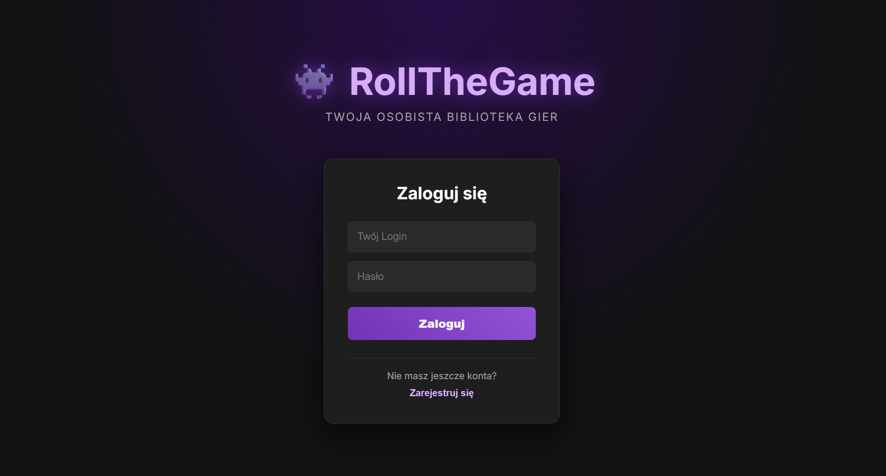
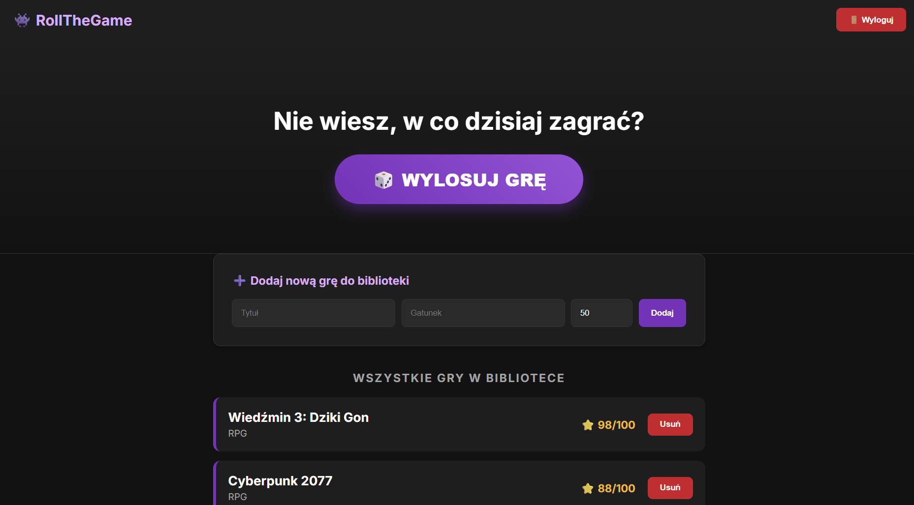
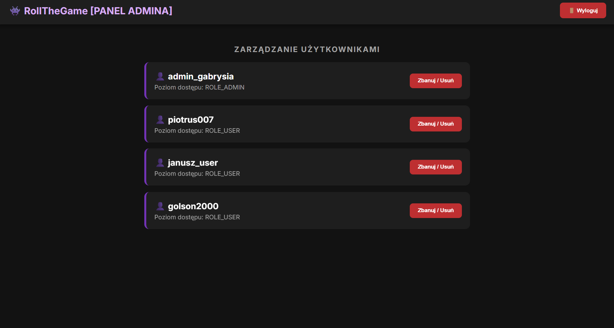
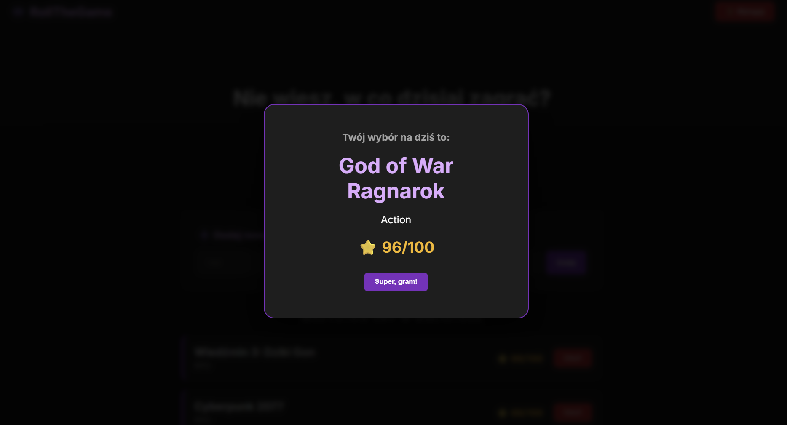

# 🎲 RollTheGame

**Your personal, intelligent game library management system.**

Stop scrolling your backlog for hours and start playing! **RollTheGame** is a full-stack application built to help gamers organize their collections, track their ratings, and—most importantly—decide exactly what to play next.

---

## 📸 Application Preview

| Login Screen | User Library Dashboard |
| :---: | :---: |
|  |  |

| Admin Management | The Randomizer |
| :---: | :---: |
|  |  |


---

## ✨ Key Features

*   **Personalized Libraries**: Thanks to strict data isolation, every user sees only their own collection. Your backlog, your rules[cite: 3, 4].
*   **Intelligent Randomizer**: Can't decide? Let the **"Roll the Game"** feature pick the perfect title from your library for your next gaming session[cite: 4, 5].
*   **Role-Based Access Control**:
    *   **Users**: Build your library, track ratings, and manage your backlog.
    *   **Admins**: Powerful admin panel to oversee all registered users in the system[cite: 3, 5].
*   **Secure Authentication**: Built with **Spring Security & JWT** (JSON Web Tokens) to ensure your data stays private and secure[cite: 3, 4].
*   **Modern Tech Stack**: Developed with a clean, layer-based architecture (Controller/Service/Repository)[cite: 4, 5].
*   **Event-Driven**: Includes asynchronous audit events for tracking new game additions.
*   **Sleek UI**: Modern, dark-themed responsive design for a premium user experience[cite: 5].

---

## 🛠 Tech Stack

**Backend**
*   **Java 17+** with **Spring Boot**
*   **Spring Security** + **JWT**
*   **PostgreSQL** (Database)
*   **Spring Data JPA / Hibernate**
*   **Testing**: JUnit 5, Mockito[cite: 4, 5]

**Frontend**
*   **Angular 17+** (Standalone Components)
*   **TypeScript**
*   **Responsive CSS**

---

## 🚀 Getting Started

### Prerequisites
*   Java 17 or higher
*   Node.js (LTS version)
*   Docker & Docker Compose

### Backend Setup
1. Clone the repository.
2. Start the database using Docker:
   
```bash
   docker-compose up -d
